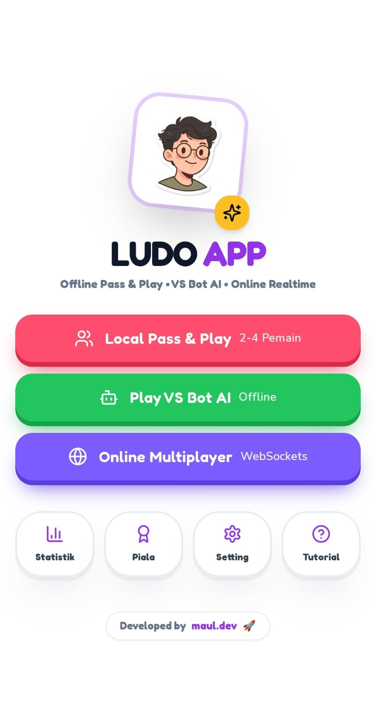

# 🎲 Ludo World Classic



[](https://nextjs.org/)
[](https://react.dev/)
[](https://www.typescriptlang.org/)
[](https://vitest.dev/)

> **Ludo World Classic** is the ultimate 4-player token racing board game built with a bright, colorful **Ludo White** theme. Features dice tumbling, home safe racing, real-time quick emotes, in-game chat, and private room multiplayer!

---

## ✨ Features

- 🎨 **Ludo White & Colorful Design**: White backdrop (`#F8FAFC`) with vibrant red, green, yellow, and blue player yards.
- 💬 **Realtime Chat & Quick Emotes**: Express yourself with quick phrases, text messages, and floating animated speech bubbles over tokens!
- 🌐 **Private Rooms & Socket Server**: Create private rooms with custom codes, invite links, player ready toggles, and socket.io sync.
- 🤖 **Smart AI Bots**: Challenge Nova, Pixel, Luna, and Bolt in offline or mixed player matches.
- ⏸️ **Pause & Exit Controls**: Clean header controls with pause overlays and safe match exit confirmation.

---

## 🛠️ Getting Started

```bash
# Clone the repository
git clone https://github.com/AlfiMaulanaA/Ludo-App.git

# Navigate into the project
cd Ludo

# Install dependencies
npm install

# Run development server
npm run dev

# Run unit tests
npm test
```

---

## 📄 License

MIT © [Alfi Maulana](https://github.com/AlfiMaulanaA)
